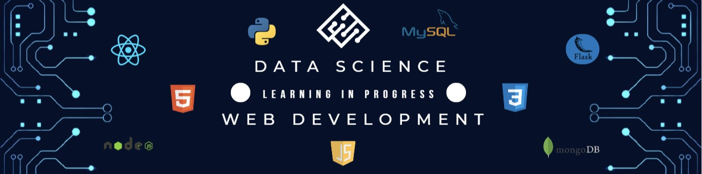

<!--
**LalitKumaran/LalitKumaran** is a ✨ _special_ ✨ repository because its `README.md` (this file) appears on your GitHub profile.

Here are some ideas to get you started:

- 🔭 I’m currently doing my Bachelor's in Computer Science in Kongu Engineering College ...
- 🌱 I’m currently learning VueJs ...
- 👯 I’m looking to collaborate on ...
- 🤔 I’m looking for help with ...
- 💬 Ask me about ...
- 📫 How to reach me: ...
- 😄 Pronouns: ...
- ⚡ Fun fact: ...
* Portfolio: https://nicolewallace.vercel.app/
-->

# Hello World, I'm Lalit! 👋 

I am a passionate Web Developer and a budding Data Scientist. I am pursuing my Bachelor’s of Engineering in Computer Science from Kongu Engineering College and also pursuing a Bachelor's in Data Science and Programming from IIT Madras. I am a ambitious person, which makes me want to always learn new things, a problem-solver who questions a lot, and a hard worker who doesn't take life too seriously and enjoys the little things.

## 💻 My Tech Stack 

* Languages: Python, Java, C, HTML, CSS, SQL
* Frameworks & Libraries: Flask, ReactJS, NodeJS, VueJS, Bootstrap, Axios, jQuery, SQLAlchemy 
* Tools:  MongoDB, MySQL, Sqlite3, Git, GitHub, VSCode, Jupyter 

## ⛓ My Links
* LinkedIn: https://www.linkedin.com/in/lalit-k-087680246/

✉️ Get in contact with me 
* Email: lalitkumaran1602@gmail.com
